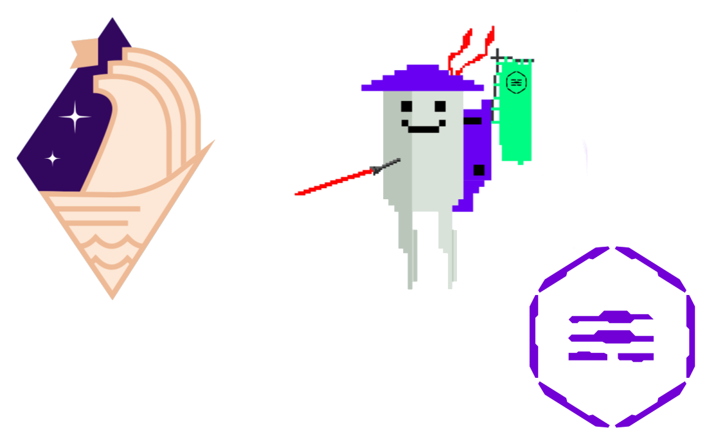

<p align="center">
   
</p>

<h1 align="center" style="margin-bottom: 0;">
    Mech Server
    <br>
    <a href="https://github.com/valory-xyz/mech-server/blob/main/LICENSE">
        
    </a>
    <a href="https://github.com/valory-xyz/mech/releases/tag/v0.10.0">
        
    </a>
</h1>

Development toolkit for the Mech ecosystem.
Provides the mech core logic, supporting easy tools integration, streamlining their development and testing.

## Requirements

You need the following requirements installed in your system:

- [Python](https://www.python.org/) (recommended `3.10`)
- [Poetry](https://python-poetry.org/docs/)
- [Docker Engine](https://docs.docker.com/engine/install/)
- [Docker Compose](https://docs.docker.com/compose/install/)
- [Tendermint](https://docs.tendermint.com/v0.34/introduction/install.html) `==0.34.19`

## CLI

All mech service operations are available through the `mech` CLI. Install the package and run `mech --help` to see available commands.

### Commands

| Command | Description |
|---|---|
| `mech setup -c <chain>` | Full first-time setup: operate build, mech deployment, env config, key setup, metadata generation, IPFS publish, and on-chain update |
| `mech run -c <chain>` | Run the mech service via Docker deployment |
| `mech run -c <chain> --dev` | Dev mode: push local packages to IPFS, refresh service hash, then run via host deployment (no Docker) |
| `mech stop -c <chain>` | Stop a running mech service |
| `mech deploy-mech -c <chain>` | Deploy a mech on the marketplace for an existing service (also runs automatically during setup) |
| `mech push-metadata` | Generate `metadata.json` from packages and publish to IPFS |
| `mech update-metadata` | Update the metadata hash on-chain via Safe transaction |
| `mech add-tool` | Scaffold a new mech tool (interactive) |

Supported chains: `gnosis`, `base`, `polygon`, `optimism`.

### Recommended user flow

Use this sequence for normal operations:

1. **Initial setup**

```bash
mech setup -c <chain>
```

2. **Update API keys in workspace `.env`**

After setup generates `.env`, set your real API keys (replace any `dummy_api_key` values), for example:

```env
API_KEYS={"openai":["<YOUR_OPENAI_KEY>"],"google_api_key":["<YOUR_GOOGLE_KEY>"]}
```

3. **If tools/packages changed, refresh metadata**

```bash
mech push-metadata
mech update-metadata
```

4. **Run the service**

```bash
mech run -c <chain>
```

5. **Stop when needed**

```bash
mech stop -c <chain>
```

### Setup

Run the full setup flow for a new mech deployment:

```bash
mech setup -c gnosis
```

This runs the following steps in order:

1. **Operate build** - Creates the service via olas-operate-middleware (skipped if service already exists)
2. **Mech deployment** - Deploys a mech on the marketplace if needed (skipped if already deployed)
3. **Env configuration** - Sets up the `.env` file with required variables
4. **Private key setup** - Configures operator and agent keys
5. **Metadata generation** - Generates `metadata.json` from package definitions
6. **IPFS publish** - Pushes metadata to IPFS
7. **On-chain update** - Updates the metadata hash on-chain via Safe transaction

### Running the service

**Production mode** (Docker deployment):

```bash
mech run -c gnosis
```

**Dev mode** (host deployment, no Docker):

```bash
mech run -c gnosis --dev
```

Dev mode pushes your local packages to IPFS, updates the config template with the new service hash, and runs the service directly on the host using `olas-operate-middleware` with `use_docker=False`. Dev mode requires a local workspace `packages/` directory.

### Stopping the service

```bash
mech stop -c gnosis
```

### Mech deployment

Deploy a mech on the marketplace. This runs automatically during `mech setup`, but can also be run standalone for an existing service:

```bash
mech deploy-mech -c gnosis
```

The mech type is determined by the `MECH_TYPE` env variable on the service. Supported types per chain:

| Chain | Native | Token | TokenUSDC | Nevermined |
|---|---|---|---|---|
| Gnosis | Yes | Yes | - | Yes |
| Base | Yes | Yes | - | Yes |
| Polygon | Yes | Yes | Yes | Yes |
| Optimism | Yes | Yes | - | Yes |

If the service already has `AGENT_ID` and `MECH_TO_CONFIG` set, deployment is skipped.

### Metadata operations

Generate and publish metadata independently of the full setup:

```bash
# Generate metadata.json and publish to IPFS
mech push-metadata

# Use a custom IPFS node
mech push-metadata --ipfs-node /dns/custom.node/tcp/5001/http

# Update the on-chain metadata hash
mech update-metadata
```

### Adding a new tool

Use this workflow to add and run a custom tool with the current setup-first model:

1. Ensure workspace/setup is initialized:

```bash
mech setup -c <gnosis|base|polygon|optimism>
```

2. Scaffold the tool:

```bash
mech add-tool <author> <tool_name> -d "My tool description"
```

3. Implement tool logic in:

```text
~/.operate-mech/packages/<author>/customs/<tool_name>/<tool_name>.py
```

4. Update component metadata in:

```text
~/.operate-mech/packages/<author>/customs/<tool_name>/component.yaml
```

5. Refresh metadata and update on-chain hash:

```bash
mech push-metadata
mech update-metadata
```

6. Run the service:

```bash
mech run -c <chain>
```

Optional: use a custom packages location when scaffolding:

```bash
mech add-tool <author> <tool_name> --packages-dir /path/to/packages
```

## Workspace troubleshooting

- `setup` auto-bootstraps workspace if missing; `run/stop` still require initialized workspace.
- `--dev` mode is for local package development and requires `packages/` inside the workspace.

## Instructions

Find more information on how to create, publish, and run your own mech tools in
[our documentation](https://stack.olas.network).
